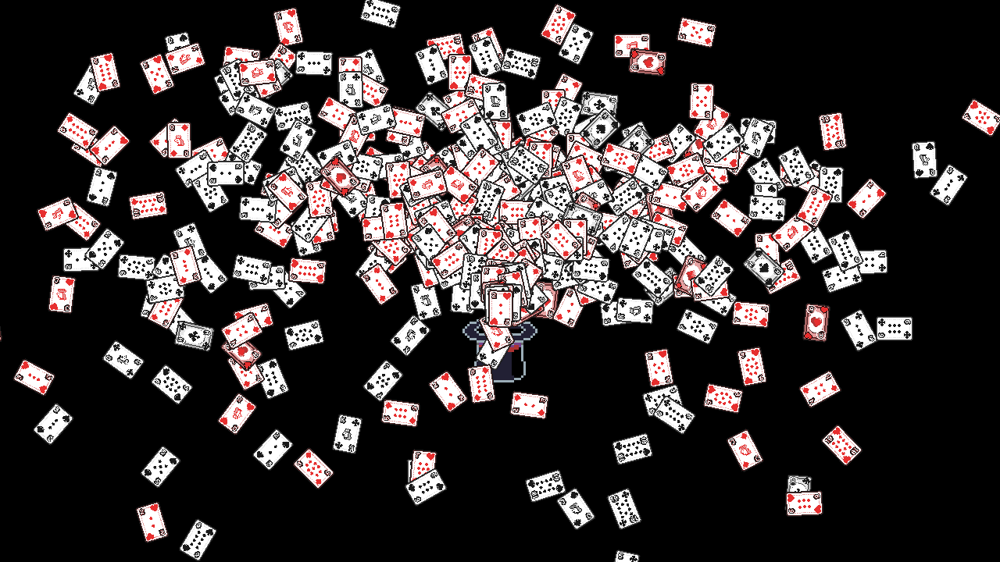
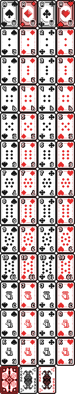

# GPU Particle Atlas
This is an example of how to use an atlas texture with a GPU particle system to render unique images for each particle.

## Overview
1) Create a texture atlas with a frame for each image.
2) Create a [GPUParticles2D](https://docs.godotengine.org/en/4.4/classes/class_gpuparticles2d.html) system. Create a shader for the Process Material that assigns a unique ID to each particle. 
3) This ID will be converted to a number between 0 and 1 and stored in the CUSTOM.z component. The CUSTOM vector is passed to the CanvasItem shader as the INCOME_CUSTOM variable. The z component is used to define the frame of the atlas to use for that particle. This is explained on the [CanvasItem shader documentation](https://docs.godotengine.org/en/4.4/tutorials/shaders/shader_reference/canvas_item_shader.html) in the Vertex built-ins section.
4) This is done by dividing the ID by the maximum possible ID value (horizontal_frames * vertical_frames = total_frames). 
5) This value will be converted to a UV coordinate in the CanvasItem shader.
6) Create a [CanvasItem shader](https://docs.godotengine.org/en/4.4/tutorials/shaders/shader_reference/canvas_item_shader.html) and set the horizontal and vertical frame counts.

### Credits

This sprite sheet is by Yewbi https://unbent.itch.io/yewbi-playing-card-set-1. I have modified the original layout to be 4 horizontal frames and 14 vertical frames. I do not use the back of the card or jokers in this demo.

